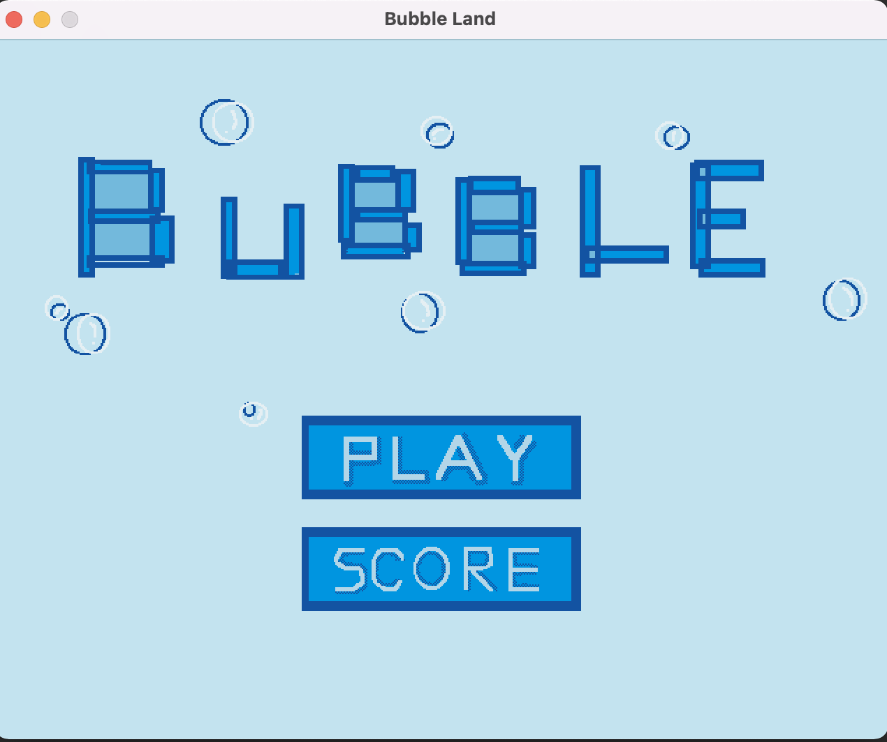
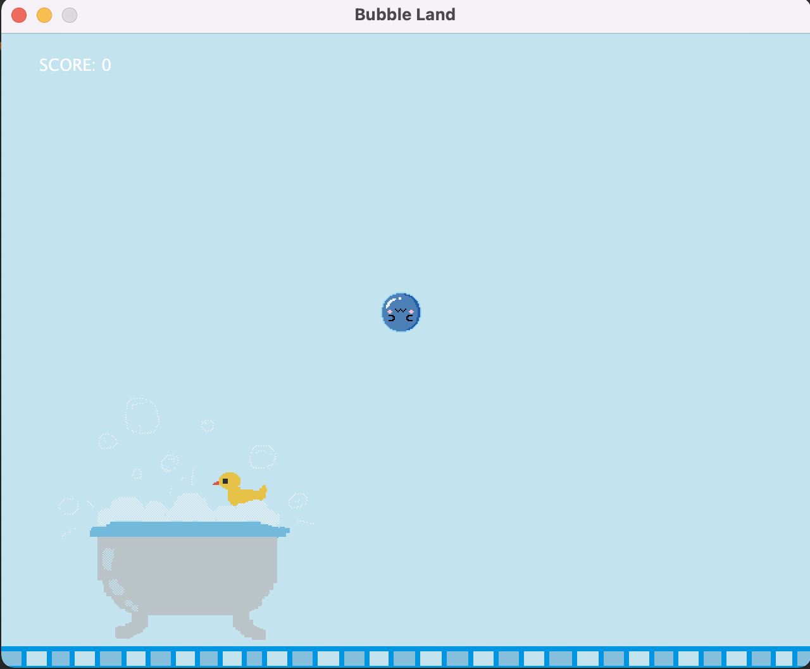
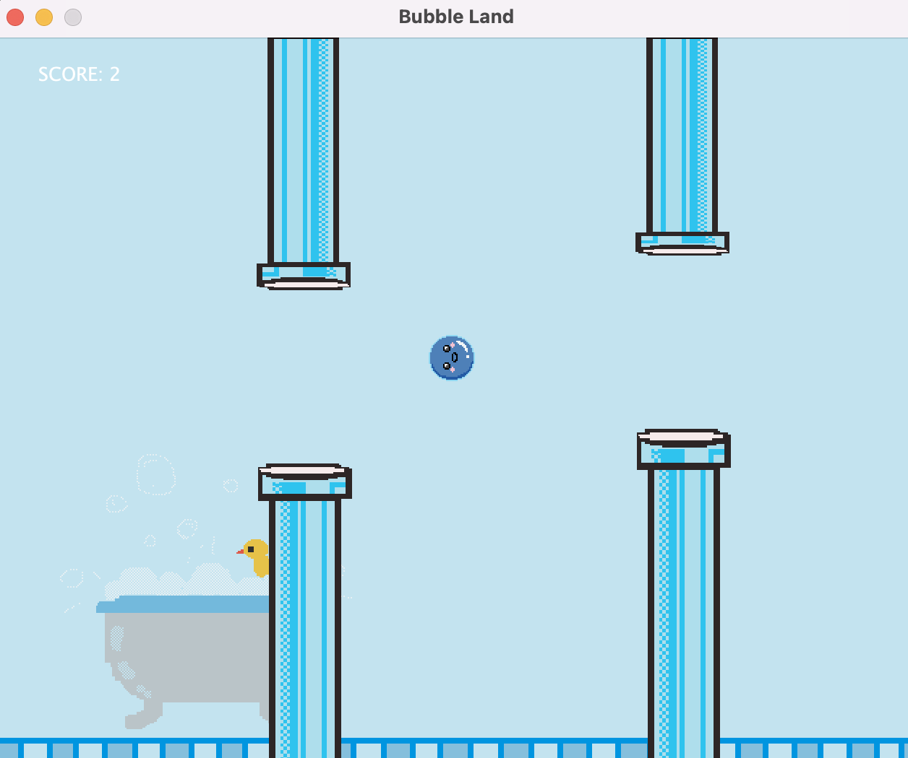
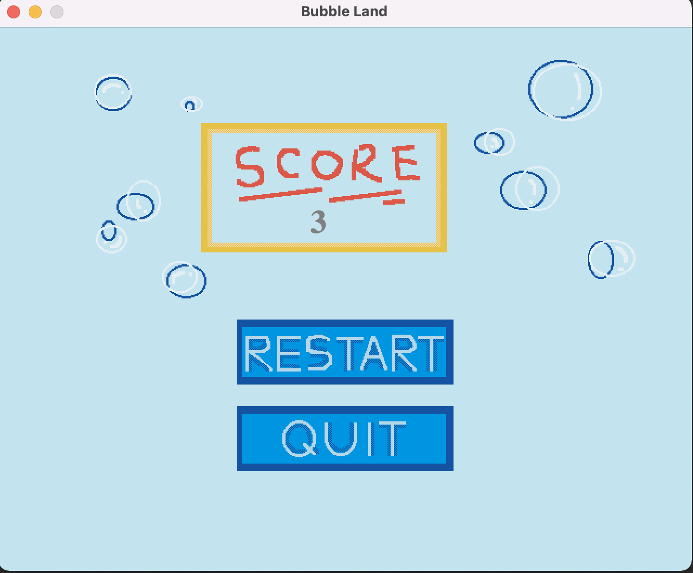

# FlappyBirdCloneGame
This is a flappy bird cloned game where the user would hit the downward key to control the movement of the bubble to avoid the barrier. Every time the bubble float pass a barrier, the score increase by one.
The project is implemeted in Java with a scalable structure. I created all the image resources with PIKSEL, below are some screenshots of the game:

